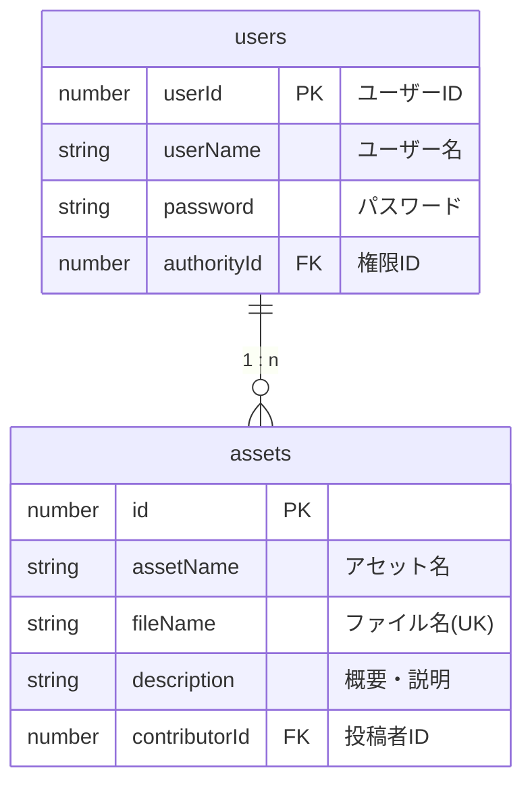
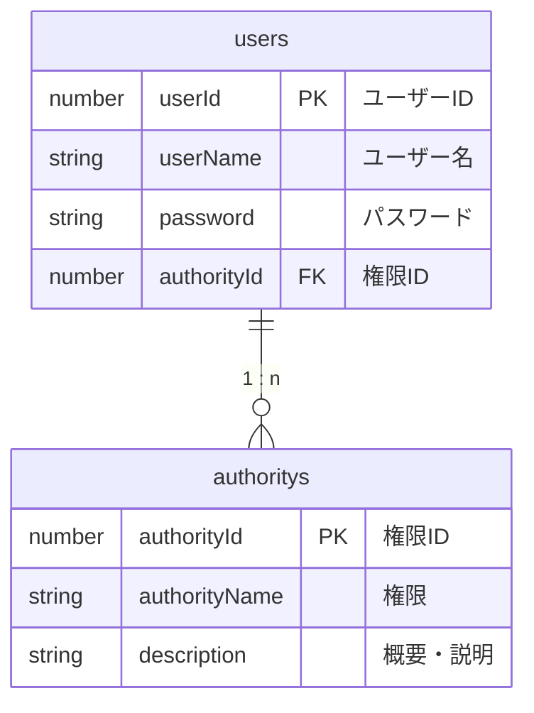

# ER図

## ユーザーとアセット

```mermaid
erDiagram

users ||--o{ assets: "1 : n"

assets {
    number id PK ""
    string assetName "アセット名"
    string fileName  "ファイル名(UK)"
    string description "概要・説明"
    number contributorId FK "投稿者ID"
}

users {
    number userId PK "ユーザーID"
    string userName "ユーザー名"
    string password "パスワード"
    number authorityId FK "権限ID"
}

```

## ユーザーと権限

```mermaid
erDiagram

users ||--o{ authoritys: "1 : n"


users {
    number userId PK "ユーザーID"
    string userName "ユーザー名"
    string password "パスワード"
    number authorityId FK "権限ID"
}

authoritys {
    number authorityId PK "権限ID"
    string authorityName "権限"
    string description "概要・説明"
}

```