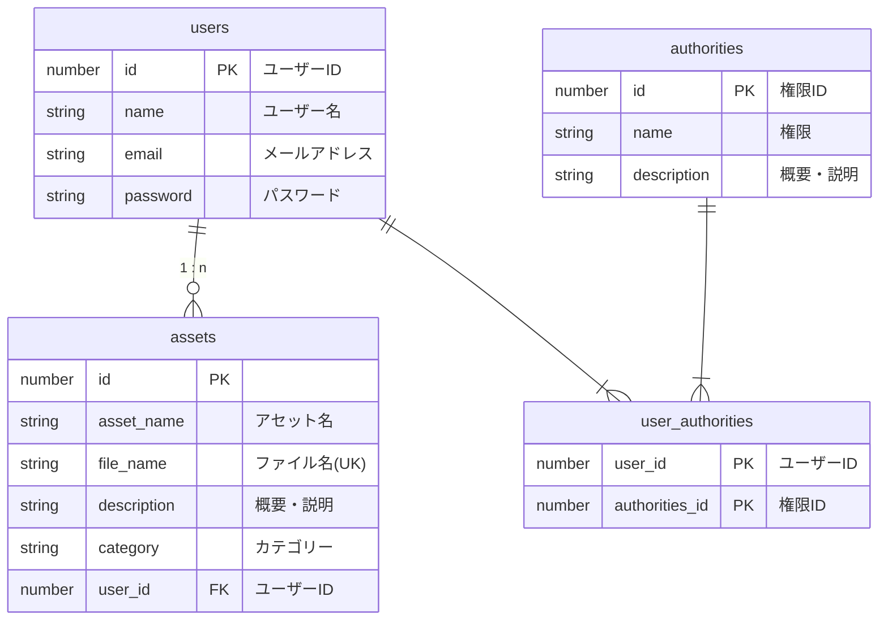

# ER図

```mermaid
erDiagram

users ||--o{ assets: "1 : n"
users ||--|{ user_authorities: ""
authorities ||--|{ user_authorities: ""

assets {
    number id PK ""
    string asset_name "アセット名"
    string file_name  "ファイル名(UK)"
    string description "概要・説明"
    string category "カテゴリー"
    number user_id FK "ユーザーID"
}

users {
    number id PK "ユーザーID"
    string name "ユーザー名"
    string email "メールアドレス"
    string password "パスワード"
}

authorities {
    number id PK "権限ID"
    string name "権限"
    string description "概要・説明"
}

user_authorities {
    number user_id PK "ユーザーID"
    number authorities_id PK "権限ID"
}

```