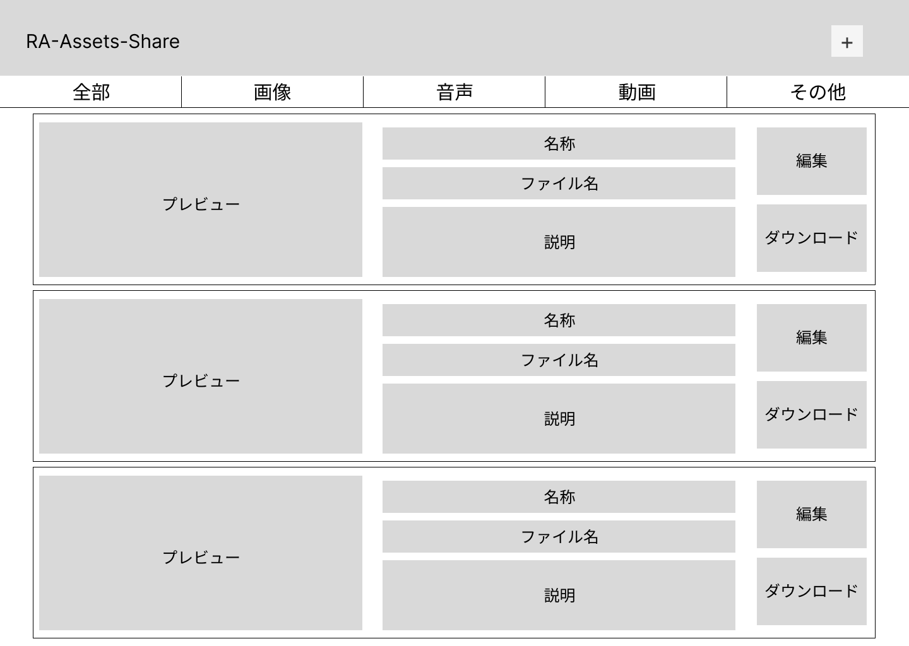

# RAアセットシェア

- RAのチーム内で扱う画像（キャラや背景）・音声・動画ファイルの共有・管理アプリ
- アセット
  - asset
  - 資産という意味
  - ここではチーム内の資産（画像・音声・動画）などの素材を指す

# 要求

メンバー全員（特に開発側やマネージャー）が現在存在しているアセット全てについて把握できるようにしたい

1. 現状、ディスコードの各部門のチャンネル上にアセットがアップロードされるがそれを管理する人がいない
2. それぞれの作者がバラバラに管理している、スマホに保存して管理しているなど、可用性の観点で望ましくない
3. 前作では専用の一覧Webページを作成し、アセットが作成される度にアセットをダウンロードしてソースを編集し更新していたが、この方法だと技術者の負担がかかる
4. 本開発が進むにつれてアセットが増えていくので効率的な管理方法が必要

# 機能

1. アセットアップロード機能
   1. フォームから（画像・音声・動画）をアップロードできる
   2. 名称・ファイル名・説明・拡張子を登録する
2. アセット一覧機能
   1. 全部・画像・音声・動画で分類を分けて見れる
   2. 1枚のカードに名称・ファイル名・説明・プレビュー（画像以外は再生機能）・開くボタン・編集ボタン・ダウンロードボタンを設置して並べる
   3. ボタンについて
      1. 開くボタン（アセット確認画面）・編集ボタン（編集画面）・ダウンロードボタン（即ダウンロード）
   4. イメージ図
      1. 
      2. [Figma](https://www.figma.com/proto/JkvCZGMyVh4pMD01SV37ai/ra-assets-share?node-id=2%3A2&scaling=min-zoom&page-id=0%3A1)
3. アセット確認画面
   1. アセット一覧で表示していたカードの大きい版
4. 編集画面
   1. アップロードと同じで名称・ファイル名・説明・拡張子を編集したりファイルを更新できたりする
   2. 編集画面からアセットの削除も可能

# メリット

1. チーム内のサイトのURLを知っているメンバーなら誰でもアセットを追加・閲覧できる
2. ディスコードだとタイムラインで流れてしまうので確認漏れがなくなる
3. アセットのバックアップにもなる